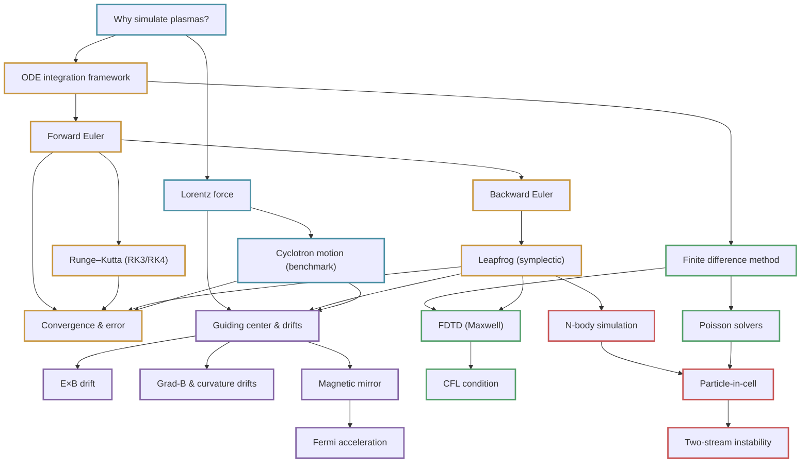

# Concept Graph · Computational EM & Plasma

Arrows mean *"understand this first"*. Machine-readable version:
[`graph/comp-plasma_graph.json`](https://github.com/tpakorn/class-wiki/blob/main/graph/comp-plasma_graph.json).

## Reading the map

- **Blue (foundations):** the physics being computed.
- **Amber (integrators):** Chapter 2 — how to march ODEs in time.
- **Purple (orbits):** Chapter 3 — single-particle motion and drift theory.
- **Green (fields):** Chapter 4 — grid-based solvers for potentials and waves.
- **Red (many-body):** Chapter 5 — the synthesis: self-consistent simulation.

**The spine of the course:**
[Lorentz force](equations/lorentz-force.md) →
[leapfrog](concepts/leapfrog-method.md) →
[drifts verified numerically](concepts/guiding-center-drifts.md) →
[Poisson on a grid](concepts/poisson-solvers.md) →
[PIC](concepts/pic-method.md) →
[two-stream instability](concepts/two-stream-instability.md).
