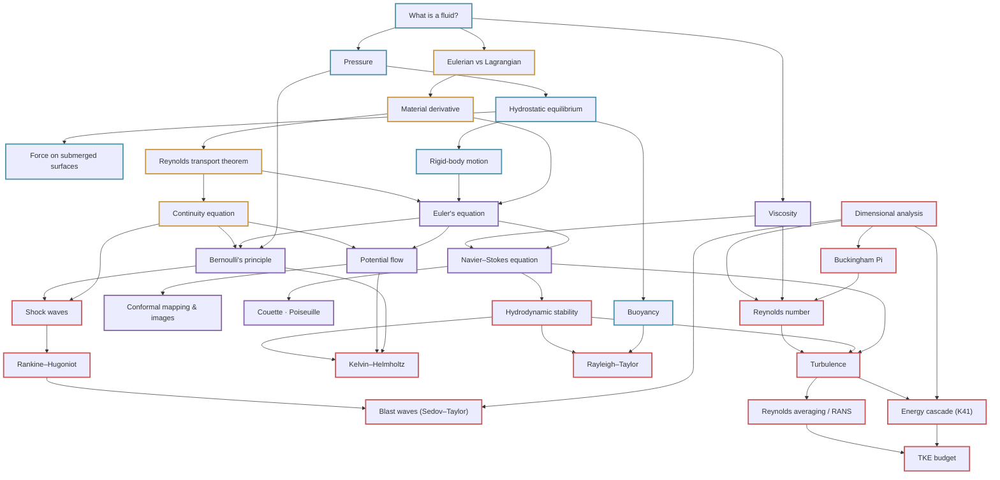

# Concept Graph · Fluid Mechanics

Arrows mean *"understand this first"*. The machine-readable version lives in
[`graph/fluids_graph.json`](https://github.com/tpakorn/class-wiki/blob/main/graph/fluids_graph.json).

## Reading the map

- **Blue (statics):** the force-balance world — no motion yet.
- **Amber (kinematics):** describing motion and the bookkeeping theorems.
- **Purple (dynamics):** the governing equations, inviscid and viscous.
- **Red (advanced):** scaling, compressibility, instability, turbulence.

**Deepest dependency chain:**
[What is a fluid?](concepts/what-is-a-fluid.md) →
[Eulerian/Lagrangian](concepts/eulerian-vs-lagrangian.md) →
[Material derivative](concepts/material-derivative.md) →
[RTT](concepts/reynolds-transport-theorem.md) →
[Euler](equations/euler-equation.md) →
[Navier–Stokes](equations/navier-stokes-equation.md) →
[Stability](concepts/hydrodynamic-stability.md) →
[Turbulence](concepts/turbulence.md) →
[Energy cascade](concepts/energy-cascade.md).
