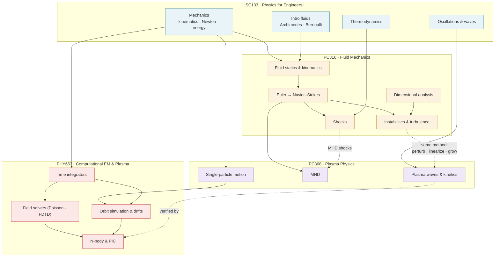

# The Knowledge Map

How the four courses fit together — each node below is a whole course region;
arrows mean *"builds on"*. Every course also has its own detailed dependency graph:
[SC133](physics1/concept-graph.md) ·
[PC368](plasma/concept-graph.md) ·
[PC316](fluids/concept-graph.md) ·
[PHY653](comp-plasma/concept-graph.md).

## The through-lines

**Continuum mechanics.** [SC133's fluids](physics1/concepts/fluids.md) preview
[PC316](fluids/index.md), which culminates in
[Navier–Stokes](fluids/equations/navier-stokes-equation.md); add electromagnetic
forces and a conducting fluid and you have [MHD in PC368](plasma/concepts/mhd.md).

**The perturbation method.** Equilibrium → perturb → linearize → normal modes →
growth rate. Learned in [PC316 stability theory](fluids/concepts/hydrodynamic-stability.md),
reused for [MHD instabilities](plasma/concepts/mhd-instability.md) and
[plasma waves](plasma/concepts/plasma-waves.md), then *measured numerically* in the
[PHY653 two-stream simulation](comp-plasma/concepts/two-stream-instability.md).

**Particles in fields.** [Newton's laws](physics1/concepts/newtons-laws.md) →
[drift theory in PC368](plasma/concepts/drift-motion.md) →
[computed orbits in PHY653](comp-plasma/concepts/guiding-center-drifts.md), where the
theory is checked against direct integration.

**Theory ↔ computation.** PC368 derives what PHY653 simulates: compare
[Landau damping](plasma/concepts/landau-damping.md) (kinetic theory) with the
[PIC method](comp-plasma/concepts/pic-method.md) sampling the same
[Vlasov equation](plasma/concepts/vlasov-equation.md).

## Machine-readable graphs

Per-course JSON dependency graphs live in the repo's
[`graph/`](https://github.com/tpakorn/class-wiki/tree/main/graph) directory —
nodes (concepts and equations, with aliases) and typed edges
(`prerequisite` / `related`), one file per course.
