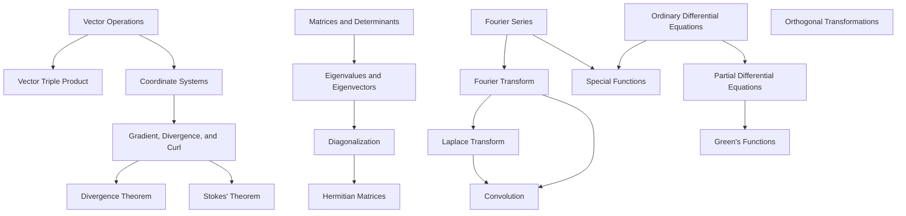

# Concept Graph

```mermaid
graph TD
    vector-operations["Vector Operations"]
    vector-triple-product["Vector Triple Product"]
    coordinate-systems["Coordinate Systems"]
    gradient-divergence-curl["Gradient, Divergence, and Curl"]
    divergence-theorem["Divergence Theorem"]
    stokes-theorem["Stokes' Theorem"]
    matrices-determinants["Matrices and Determinants"]
    eigenvalues-eigenvectors["Eigenvalues and Eigenvectors"]
    diagonalization["Diagonalization"]
    hermitian-matrices["Hermitian Matrices"]
    fourier-series["Fourier Series"]
    fourier-transform["Fourier Transform"]
    laplace-transform["Laplace Transform"]
    convolution["Convolution"]
    ordinary-differential-equations["Ordinary Differential Equations"]
    special-functions["Special Functions"]
    partial-differential-equations["Partial Differential Equations"]
    greens-functions["Green's Functions"]
    orthogonal-transformations["Orthogonal Transformations"]
    vector-operations --> vector-triple-product
    vector-operations --> coordinate-systems
    coordinate-systems --> gradient-divergence-curl
    gradient-divergence-curl --> divergence-theorem
    gradient-divergence-curl --> stokes-theorem
    matrices-determinants --> eigenvalues-eigenvectors
    eigenvalues-eigenvectors --> diagonalization
    diagonalization --> hermitian-matrices
    fourier-series --> fourier-transform
    fourier-transform --> laplace-transform
    fourier-transform --> convolution
    laplace-transform --> convolution
    ordinary-differential-equations --> special-functions
    ordinary-differential-equations --> partial-differential-equations
    partial-differential-equations --> greens-functions
    fourier-series --> special-functions
```
