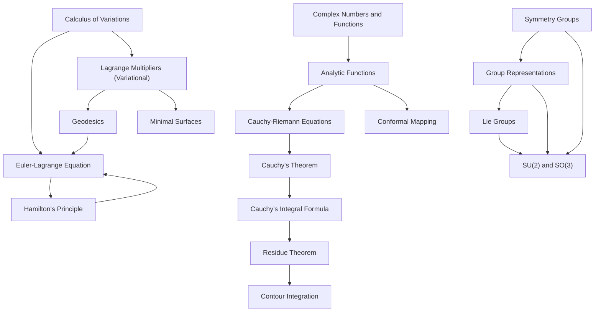

# Concept Graph

```mermaid
graph TD
    calculus-of-variations["Calculus of Variations"]
    euler-lagrange-equation["Euler-Lagrange Equation"]
    lagrange-multipliers["Lagrange Multipliers (Variational)"]
    geodesics["Geodesics"]
    minimal-surfaces["Minimal Surfaces"]
    hamilton-principle["Hamilton's Principle"]
    complex-numbers["Complex Numbers and Functions"]
    analytic-functions["Analytic Functions"]
    cauchy-riemann["Cauchy-Riemann Equations"]
    cauchy-theorem["Cauchy's Theorem"]
    cauchy-integral-formula["Cauchy's Integral Formula"]
    residue-theorem["Residue Theorem"]
    contour-integration["Contour Integration"]
    conformal-mapping["Conformal Mapping"]
    symmetry-groups["Symmetry Groups"]
    group-representations["Group Representations"]
    lie-groups["Lie Groups"]
    su2-so3["SU(2) and SO(3)"]
    calculus-of-variations --> euler-lagrange-equation
    calculus-of-variations --> lagrange-multipliers
    lagrange-multipliers --> geodesics
    lagrange-multipliers --> minimal-surfaces
    euler-lagrange-equation --> hamilton-principle
    hamilton-principle --> euler-lagrange-equation
    geodesics --> euler-lagrange-equation
    complex-numbers --> analytic-functions
    analytic-functions --> cauchy-riemann
    cauchy-riemann --> cauchy-theorem
    cauchy-theorem --> cauchy-integral-formula
    cauchy-integral-formula --> residue-theorem
    residue-theorem --> contour-integration
    analytic-functions --> conformal-mapping
    symmetry-groups --> group-representations
    group-representations --> lie-groups
    lie-groups --> su2-so3
    symmetry-groups --> su2-so3
    group-representations --> su2-so3
```
