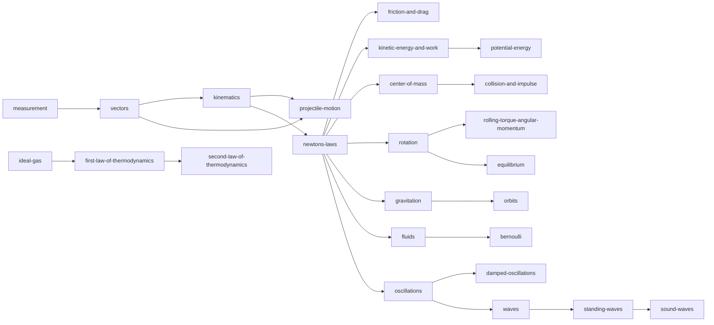

# Concept Graph

```mermaid
flowchart LR
    measurement --> vectors
    vectors --> kinematics
    kinematics --> projectile-motion
    vectors --> projectile-motion
    kinematics --> newtons-laws
    newtons-laws --> friction-and-drag
    newtons-laws --> kinetic-energy-and-work
    kinetic-energy-and-work --> potential-energy
    newtons-laws --> center-of-mass
    center-of-mass --> collision-and-impulse
    newtons-laws --> rotation
    rotation --> rolling-torque-angular-momentum
    rotation --> equilibrium
    newtons-laws --> gravitation
    gravitation --> orbits
    newtons-laws --> fluids
    fluids --> bernoulli
    newtons-laws --> oscillations
    oscillations --> damped-oscillations
    oscillations --> waves
    waves --> standing-waves
    standing-waves --> sound-waves
    ideal-gas --> first-law-of-thermodynamics
    first-law-of-thermodynamics --> second-law-of-thermodynamics
```
