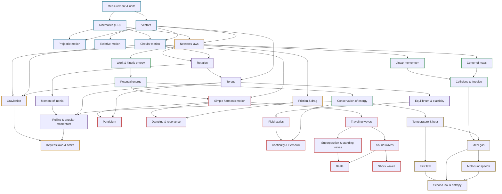

# Concept Graph · Physics I

Arrows mean *"understand this first"*. Machine-readable version:
[`graph/physics1_graph.json`](https://github.com/tpakorn/class-wiki/blob/main/graph/physics1_graph.json).

## Reading the map

- **Blue:** describing motion (kinematics & vectors)
- **Amber:** forces — Newton's program
- **Green:** the conservation laws (energy, momentum)
- **Purple:** rotation
- **Red:** continuous matter — fluids, oscillations, waves
- **Gold:** thermodynamics

**The spine:** [kinematics](concepts/kinematics.md) →
[Newton's laws](concepts/newtons-laws.md) →
[energy](concepts/conservation-of-energy.md) &
[momentum](concepts/linear-momentum.md) →
[rotation](concepts/rotation.md) → [SHM](concepts/simple-harmonic-motion.md) →
[waves](concepts/waves.md) → [entropy](concepts/second-law-of-thermodynamics.md).
