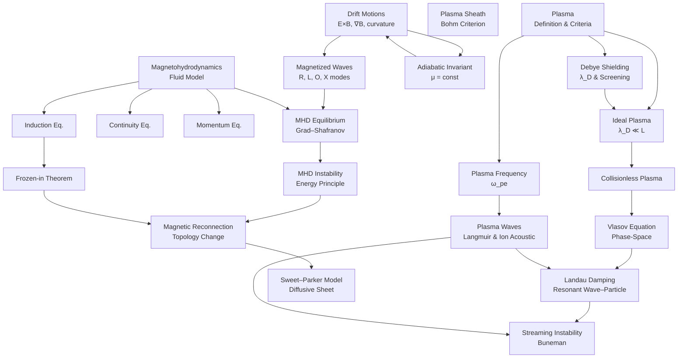

# Concept Dependency Graph

This Mermaid graph shows prerequisite and extension relationships among the
major topics of PC368.

```mermaid
graph TD
    Plasma[Plasma<br/>Definition & Criteria]
    Debye[Debye Shielding<br/>λ_D & Screening]
    IdealPlasma[Ideal Plasma<br/>λ_D ≪ L]
    PlasmaFreq[Plasma Frequency<br/>ω_pe]
    Vlasov[Vlasov Equation<br/>Phase-Space]
    Collisionless[Collisionless Plasma]
    MHD[Magnetohydrodynamics<br/>Fluid Model]
    Continuity[Continuity Eq.]
    Momentum[Momentum Eq.]
    Induction[Induction Eq.]
    FrozenIn[Frozen-in Theorem]
    Sheath[Plasma Sheath<br/>Bohm Criterion]
    Drift[Drift Motions<br/>E×B, ∇B, curvature]
    Adiabatic[Adiabatic Invariant<br/>μ = const]
    Waves[Plasma Waves<br/>Langmuir & Ion Acoustic]
    Streaming[Streaming Instability<br/>Buneman]
    Landau[Landau Damping<br/>Resonant Wave–Particle]
    MagWaves[Magnetized Waves<br/>R, L, O, X modes]
    MHDEquil[MHD Equilibrium<br/>Grad–Shafranov]
    MHDInstab[MHD Instability<br/>Energy Principle]
    Reconnection[Magnetic Reconnection<br/>Topology Change]
    SweetParker[Sweet–Parker Model<br/>Diffusive Sheet]

    Plasma --> Debye
    Plasma --> PlasmaFreq
    Plasma --> IdealPlasma
    Debye --> IdealPlasma
    IdealPlasma --> Collisionless
    Collisionless --> Vlasov
    PlasmaFreq --> Waves
    Vlasov --> Landau
    Landau --> Streaming
    Waves --> Streaming
    Waves --> Landau
    MHD --> Continuity
    MHD --> Momentum
    MHD --> Induction
    Induction --> FrozenIn
    Drift --> Adiabatic
    Drift --> MagWaves
    MagWaves --> MHDEquil
    MHD --> MHDEquil
    MHDEquil --> MHDInstab
    MHDInstab --> Reconnection
    Reconnection --> SweetParker
    Adiabatic --> Drift
    FrozenIn --> Reconnection
```
