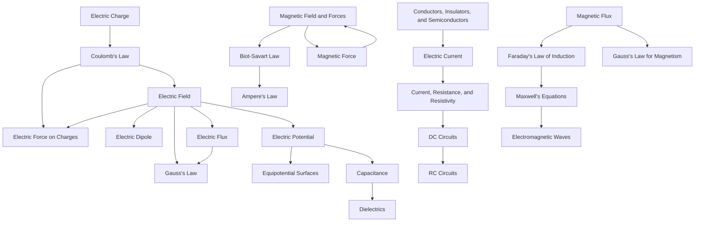

# Concept Graph

```mermaid
graph TD
    electric-charge["Electric Charge"]
    conductors-insulators["Conductors, Insulators, and Semiconductors"]
    electric-current["Electric Current"]
    coulombs-law["Coulomb's Law"]
    electric-field["Electric Field"]
    electric-force["Electric Force on Charges"]
    electric-dipole["Electric Dipole"]
    gauss-law["Gauss's Law"]
    electric-flux["Electric Flux"]
    electric-potential["Electric Potential"]
    equipotential["Equipotential Surfaces"]
    capacitance["Capacitance"]
    dielectrics["Dielectrics"]
    current-resistance["Current, Resistance, and Resistivity"]
    dc-circuits["DC Circuits"]
    rc-circuits["RC Circuits"]
    magnetic-field["Magnetic Field and Forces"]
    magnetic-force["Magnetic Force"]
    biot-savart-law["Biot-Savart Law"]
    amperes-law["Ampere's Law"]
    faraday-law["Faraday's Law of Induction"]
    magnetic-flux["Magnetic Flux"]
    gauss-law-magnetism["Gauss's Law for Magnetism"]
    maxwell-equations["Maxwell's Equations"]
    electromagnetic-waves["Electromagnetic Waves"]
    electric-charge --> coulombs-law
    coulombs-law --> electric-force
    coulombs-law --> electric-field
    electric-field --> electric-force
    electric-field --> electric-dipole
    conductors-insulators --> electric-current
    electric-current --> current-resistance
    electric-field --> gauss-law
    electric-field --> electric-flux
    electric-flux --> gauss-law
    electric-field --> electric-potential
    electric-potential --> equipotential
    electric-potential --> capacitance
    capacitance --> dielectrics
    dc-circuits --> rc-circuits
    current-resistance --> dc-circuits
    magnetic-force --> magnetic-field
    magnetic-field --> biot-savart-law
    biot-savart-law --> amperes-law
    magnetic-field --> magnetic-force
    magnetic-flux --> faraday-law
    magnetic-flux --> gauss-law-magnetism
    faraday-law --> maxwell-equations
    maxwell-equations --> electromagnetic-waves
```
